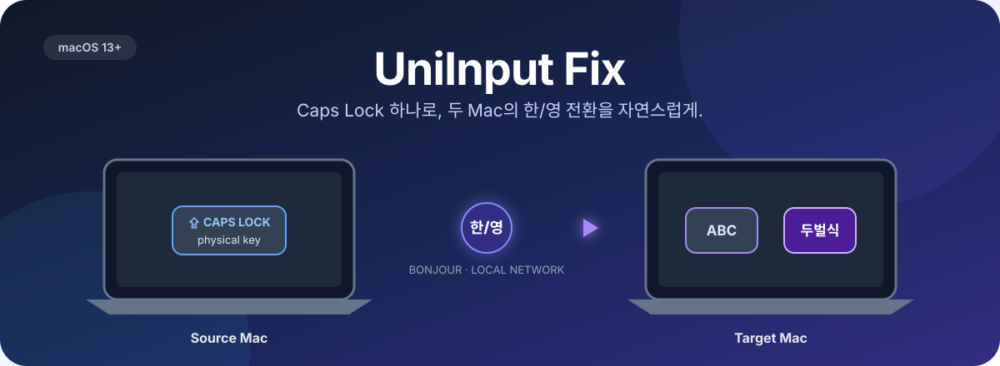

<p align="center">
  
</p>

<h1 align="center">Universal Control Helper</h1>

<p align="center">
  <strong>Universal Control의 키보드 입력 문제를 바로잡습니다.</strong>
  <br />
  <sub>키보드 하나, Mac 두 대, 익숙한 전환 방식 그대로.</sub>
</p>

<p align="center">
  <a href="https://github.com/feelgom/universal-control-helper/actions/workflows/ci.yml"></a>
  <a href="https://github.com/feelgom/universal-control-helper/releases/latest"></a>
  <a href="https://github.com/feelgom/universal-control-helper/stargazers"></a>
  <a href="LICENSE"></a>
  
</p>

<p align="center">
  <a href="#빠른-시작">빠른 시작</a> ·
  <a href="#사용법">사용법</a> ·
  <a href="#어떻게-동작하나요">작동 방식</a> ·
  <a href="#업데이트">업데이트</a> ·
  <a href="#개발">개발</a>
</p>

---

macOS Universal Control로 다른 Mac을 조작할 때 Caps Lock을 눌러도 한/영 전환이 되지 않는 경우가 있습니다. Universal Control Helper는 **물리 키보드의 Caps Lock 누름만** Source Mac에서 감지하고, 로컬 네트워크를 통해 Target Mac의 `ABC ↔ 두벌식` 입력 소스를 전환합니다.

> Apple과 제휴하거나 Apple이 보증한 제품이 아닌 비공식 오픈 소스 유틸리티입니다.


## 빠른 시작

### 설치 스크립트 — 권장

다음 명령은 최신 GitHub Release를 내려받고, 게시된 SHA-256 체크섬과 앱 서명을 확인한 뒤 `/Applications`에 설치합니다. 기존 설치본은 삭제하지 않고 사용자 Library의 백업 폴더로 이동합니다.

```bash
curl -fsSL https://github.com/feelgom/universal-control-helper/releases/latest/download/install.sh | bash
```

실행 전에 스크립트를 확인하려면:

```bash
curl -fsSL https://github.com/feelgom/universal-control-helper/releases/latest/download/install.sh -o /tmp/universal-control-helper-install.sh
less /tmp/universal-control-helper-install.sh
bash /tmp/universal-control-helper-install.sh
```

앱을 자동 실행하지 않거나 다른 폴더에 설치할 수도 있습니다.

```bash
bash /tmp/universal-control-helper-install.sh --no-launch
bash /tmp/universal-control-helper-install.sh --install-dir "$HOME/Applications"
```

### 직접 설치

[최신 Release](https://github.com/feelgom/universal-control-helper/releases/latest)에서 `UniversalControlHelper-macOS-universal.zip`을 받아 압축을 풀고 `Universal Control Helper.app`을 `/Applications`로 옮깁니다.

> [!IMPORTANT]
> 현재 공개 빌드는 Apple Developer ID 서명·공증 없이 배포됩니다. 첫 실행 시 Finder에서 앱을 Control-클릭한 뒤 **열기**를 선택해야 할 수 있습니다.

## 사용법

두 Mac에 앱을 설치한 다음 역할과 페어링 코드만 맞추면 됩니다.

| Mac | 역할 | 필요한 권한 | 할 일 |
| --- | --- | --- | --- |
| 키보드가 연결된 Mac | **키보드 Mac (Source)** | 입력 모니터링, 로컬 네트워크 | 자동 생성된 코드 확인 |
| 조작할 다른 Mac | **대상 Mac (Target)** | 로컬 네트워크 | Source의 코드 입력 |

1. 두 Mac을 같은 로컬 네트워크에 연결하고 Universal Control을 활성화합니다.
2. 메뉴 막대의 **설정…** 또는 `Command-,`로 설정창을 엽니다.
3. 키보드가 연결된 Mac은 Source, 다른 Mac은 Target으로 선택합니다.
4. Source에 자동 생성된 **페어링 코드**를 Target에 입력합니다.
5. 두 Mac에서 로컬 네트워크를 허용하고, Source에서만 입력 모니터링을 허용합니다.

설정창에서는 역할, 연결 상태, 페어링 코드와 권한 상태를 한 번에 확인할 수 있습니다. `Command-Tab`으로 앱을 선택하거나 `Command-,`를 누르면 설정창으로 돌아옵니다. Source에는 입력 모니터링과 로컬 네트워크를, Target에는 로컬 네트워크만 표시합니다. 접근성 권한은 필요하지 않습니다.

## 어떻게 동작하나요?

```text
물리 Caps Lock
      │
      ▼
Source Mac ── Bonjour / 같은 LAN ──▶ Target Mac
  입력 감지       6자리 코드 확인       ABC ↔ 두벌식
```

- Source는 물리 키보드의 Caps Lock 누름만 감지합니다.
- Source의 원래 Caps Lock 한/영 전환은 차단하지 않고 그대로 유지합니다.
- Bonjour로 Target을 자동 검색하고, 코드가 일치한 연결만 처리합니다.
- Target은 현재 입력 소스를 확인한 뒤 macOS API로 ABC와 두벌식을 직접 전환합니다.
- 일반 키 입력, 입력한 텍스트, 클립보드, 마우스 이벤트는 수집하거나 전송하지 않습니다.

### 현재 범위

- macOS 13 이상
- `ABC ↔ 두벌식` 조합
- 신뢰할 수 있는 동일 로컬 네트워크
- Source가 실행 중이면 Caps Lock 전환을 Target에 자동 전달

페어링 코드는 같은 네트워크의 다른 앱을 구분하는 용도이며 네트워크 암호화를 제공하지 않습니다. 공용·비신뢰 네트워크에서는 사용하지 마세요.

## 업데이트

앱은 [Sparkle](https://sparkle-project.org/)로 GitHub Release의 EdDSA 서명 업데이트를 확인합니다. 메뉴 막대에서 **업데이트 확인**..을 선택하거나 기본 주기 확인을 이용할 수 있습니다.

Developer ID가 없는 현재 공개 빌드는 버전이 바뀌면 macOS가 새 앱으로 인식해 Source Mac의 입력 모니터링 권한을 다시 요청할 수 있습니다. 시스템 설정의 스위치가 켜져 있는데 **현재 앱에는 미허용**으로 표시되면 **권한 초기화…**로 이 앱의 오래된 항목만 정리한 뒤 현재 앱을 다시 허용하세요. **권한 다시 확인**은 실제 HID 모니터를 다시 열고, macOS가 재실행을 요구하는 경우 앱을 자동으로 다시 시작합니다.

권한 확인은 `IOHIDCheckAccess`, Core Graphics 사전 확인과 실제 HID 모니터 시작 결과를 함께 사용합니다. 설정 목록의 모양이 아니라 현재 실행 중인 앱이 실제로 Caps Lock을 감지할 수 있는지를 기준으로 표시합니다.

## 개발

```bash
swift test -Xswiftc -warnings-as-errors
BUILD_UNIVERSAL=1 ./scripts/build-app.sh
REQUIRE_UNIVERSAL=1 ./scripts/verify-release.sh
```

`v*` 태그를 푸시하면 GitHub Actions가 테스트, Universal Binary 빌드, Sparkle 서명, 앱캐스트 생성과 Release 업로드를 수행합니다. 자세한 절차는 [RELEASING.md](RELEASING.md)를 참고하세요.

## Star History

<p align="center">
  <a href="https://www.star-history.com/?repos=feelgom%2Funiversal-control-helper&type=date&legend=top-left">
    <picture>
      <source media="(prefers-color-scheme: dark)" srcset="https://api.star-history.com/chart?repos=feelgom/universal-control-helper&type=date&theme=dark&legend=top-left&sealed_token=FwEg8EPGkwsDKHlbN4MhzmytFu5S0LOeuuX13EWlrAvb6dZKzGz0W7xg_2wxftWukmAlnqMS9DlVzbhB1zmZXNecoFq1n6Y6Mt30B8OCIzTj10uCc3ZKJQ" />
      <source media="(prefers-color-scheme: light)" srcset="https://api.star-history.com/chart?repos=feelgom/universal-control-helper&type=date&legend=top-left&sealed_token=FwEg8EPGkwsDKHlbN4MhzmytFu5S0LOeuuX13EWlrAvb6dZKzGz0W7xg_2wxftWukmAlnqMS9DlVzbhB1zmZXNecoFq1n6Y6Mt30B8OCIzTj10uCc3ZKJQ" />
      
    </picture>
  </a>
</p>

## 보안 및 기여

- 보안 문제는 공개 Issue 대신 [보안 정책](SECURITY.md)에 안내된 비공개 신고 기능을 이용해 주세요.
- 버그 제보와 개선 제안은 [GitHub Issues](https://github.com/feelgom/universal-control-helper/issues)에서 받습니다.
- 코드는 [MIT License](LICENSE)로 배포됩니다.
